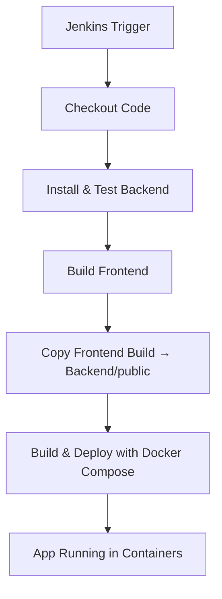
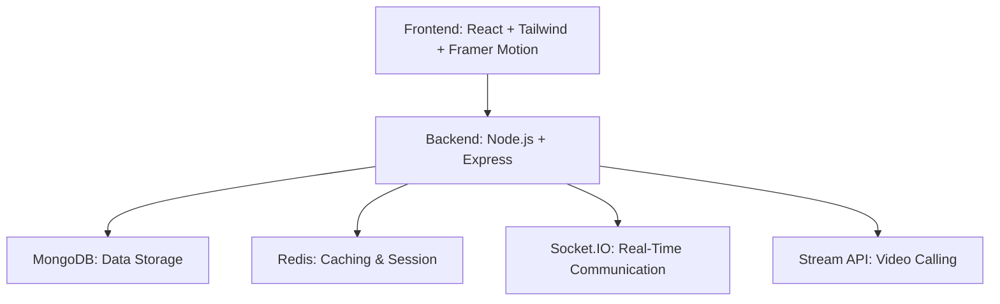

# 🚀 Project Helper  

  
  
  

**Project Helper** is a real-time project collaboration platform where developers can **share ideas, manage tasks, chat, and video call—all in one place**. Designed for scalability, performance, and a great user experience.  

🌐 **Live Demo:** [project-helper-aqm2.onrender.com](https://project-helper-aqm2.onrender.com)  

🛗 **Demo credentials for accessing:**
- Email: raj@gmail.com
- Password: 1234

---

## ✨ Key Features  

### 🔐 Authentication & Security  
- ✅ Secure login/signup with **JWT** + HTTP-only cookies  
- 🔄 Persistent sessions with refresh tokens  

### 📁 Project Management  
- ➕ Create, join & manage projects  
- ✅ Task & issue tracking  
- 🆘 Fix issues and do tasks to increase contribution  
- 📊 Contribution chart

### 💬 Real-Time Chat  
- 🗣️ Private & group chats powered by **Socket.IO**  
- 👀 Seen/unseen message indicators  
- 📍 Unread message count with real-time updates  
- ✏️ Edit & delete messages (real-time updates)  
- 🔔 Live message notifications  

### 🎥 Video Calling  
- 👥 Group and peer-to-peer video calls powered by **Stream API**  

### 👥 Friends & Notifications  
- ✅ Send/accept/reject friend requests  
- 🟢 Real-time online/offline updates  
- 🔔 Notifications for messages and project events  

### ⚡ Performance & UX  
- ⚡ Redis caching and session handling  
- 🕜 Demo background jobs with **BullMQ** and **Redis pub/sub**  
- 🔍 Search based loading in backend  
- 📇 Indexed MongoDB schemas for performance  
- 🔄 Compression and pagination for speed  
- 🎨 Responsive UI with **Framer Motion** animations  
- 🧪 End-to-end tested with **Jest** and **Supertest**  

### 👨‍💻 DevOps  
- 🐳 **Dockerized Full Stack**  
  - Backend, Frontend, MongoDB, and Redis in isolated containers  
  - Volume mounts for persistent data  
- ⚙️ **Jenkins CI/CD Pipeline**  
  - Automated **build → test → deploy**  
  - Multi-stage pipeline:  
    1. Install & test backend  
    2. Build frontend  
    3. Move frontend build into backend  
    4. Build & deploy with **Docker Compose**  
- 🔐 **Environment Management**  
  - Injects `.env` variables securely during the pipeline  
- 🖥 **Runs on Windows Jenkins Agent**  
  - Installs dependencies like Visual C++ Redistributable automatically  
- 🚀 **Ready for Scaling**  
  - Works in containerized environments with Docker Compose  
  - Easily extended to Kubernetes  

### 📊 Monitoring  
- 📈 **Prometheus Integration**  
  - Exposes backend metrics via `/metrics` endpoint using `prom-client`  
  - Collects default Node.js process metrics (CPU usage, memory, event loop, etc.)  

- 📉 **Grafana Dashboard**  
  - Connected to Prometheus for visualizing backend metrics  

#### CI/CD Workflow Visualization  

---

## 🛠 Tech Stack  

| Layer           | Technologies                                      |
| --------------- | ------------------------------------------------- |
| **Frontend**    | React, Tailwind CSS, Framer Motion               |
| **Backend**     | Node.js, Express                                 |
| **Database**    | MongoDB                                          |
| **Real-Time**   | Socket.IO                                        |
| **Video Calls** | Stream API                                       |
| **Caching**     | Redis                                            |
| **Auth**        | JWT + Secure Cookies                             |
| **Hosting**     | Render                                           |
| **Testing**     | Jest, SuperTest                                  |
| **Background-Jobs**   | BullMq, Redis pub/sub                       |
---

---
## 📦 Getting Started (Local Setup)

## 1. Clone the Repository

```bash
git clone https://github.com/Raj-dev08/Project-helper
cd Project-helper
```

## 2. Setup env variables 

### backend/.env
- PORT=5000
- MONGO_URI=your_mongodb_uri
- JWT_SECRET=your_jwt_secret
- REDIS_URL=your_redis_url
- STREAM_API_KEY=your_stream_key
- STREAM_API_SECRET=your_stream_secret

- ARCJET_KEY= your_arcjet_key

- API_KEY=your_api_key(optional)


### frontend/.env
- VITE_STREAM_KEY=your_stream_key

- VITE_API_KEY=your_api_key
  
## 3. Run locally 

```
cd backend
npm install
npm run dev
```

```
cd frontend
npm install
npm run dev
```

---

## 🏗 Architecture  
